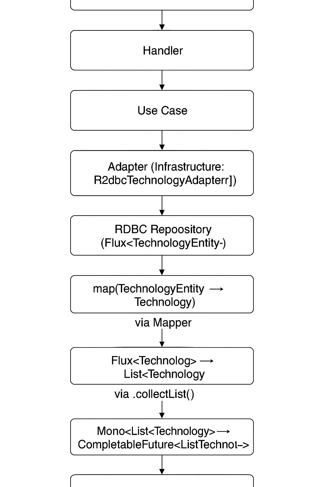

# spring-reactive-hexagon

Service for Demo Spring Reactive with Hexagonal Pattern Adapters, Ports and Router Functions

🧱 Capas y responsabilidades:

| Capa                    | Componente                                         | Rol                                        |
|-------------------------|----------------------------------------------------|--------------------------------------------|
| Infraestructura         | R2DBC Repository                                   | Interactúa con la base de datos            |
| Mapper                  | Convierte entre TechnologyEntity y Technology      |
| Adapter                 | Implementa el puerto y maneja conversión + Reactor |
| Aplicación              | UseCase                                            | Orquesta la lógica de negocio              |
| Dominio                 | Modelo (Technology)                                | Representa el core del negocio             |
| Puerto (TechnologyPort) | Interfaz que define contrato de persistencia       |
| Web                     | Handler                                            | Recibe la solicitud, invoca el caso de uso |
| RouterFunction          | Mapea la ruta a un handler                         |

### Diagrama de Operaciones

